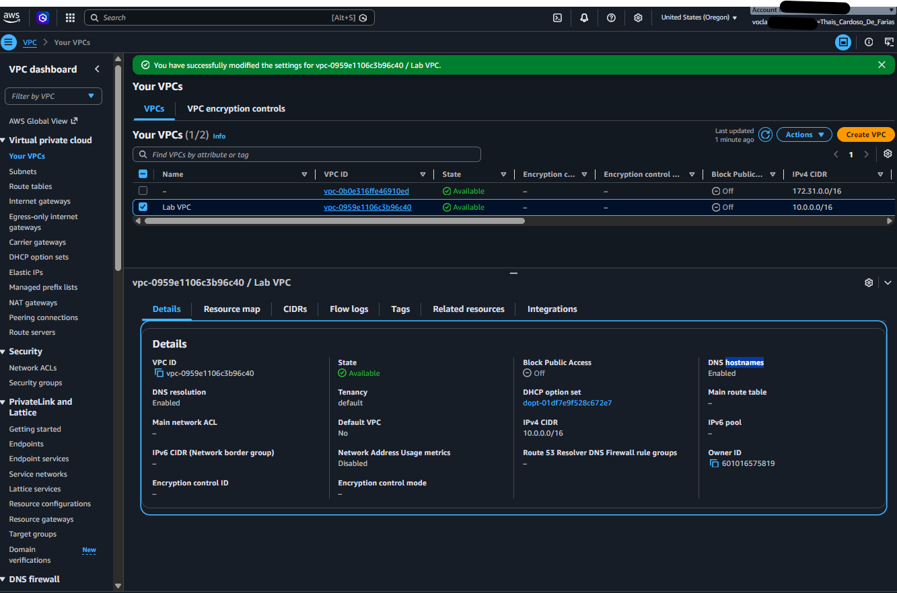
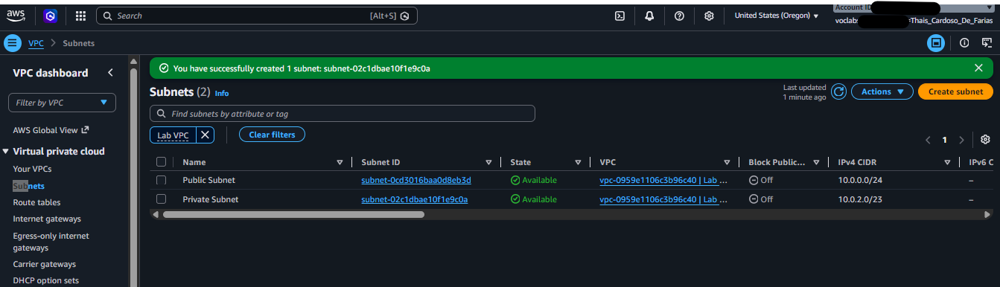
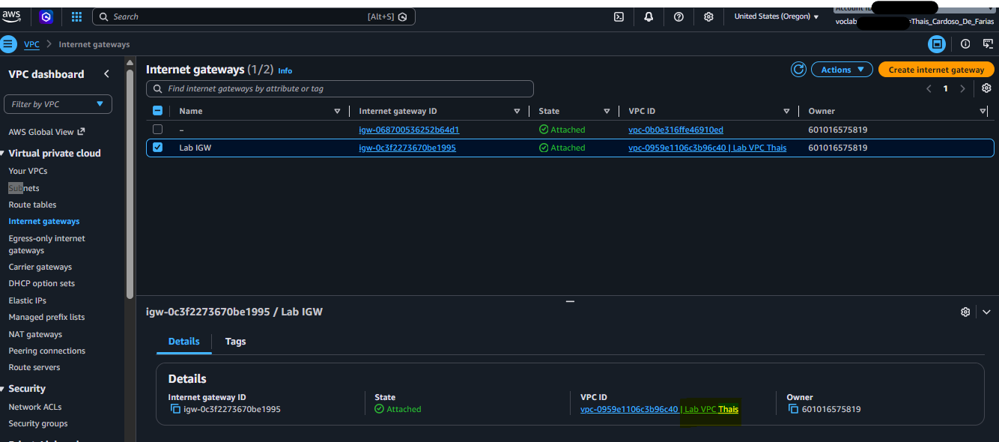
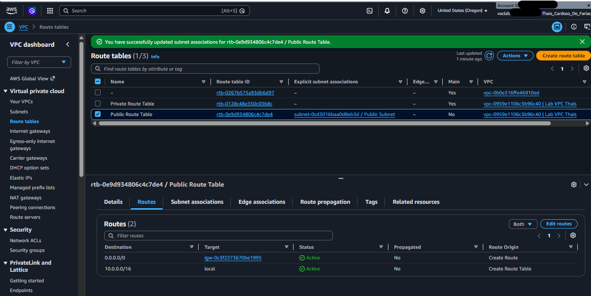
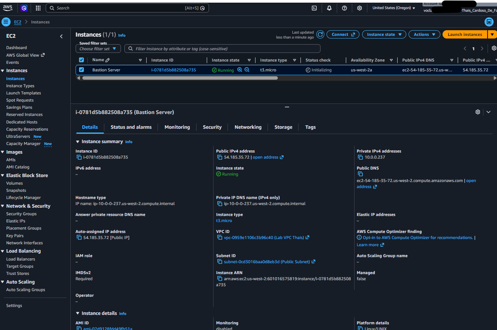
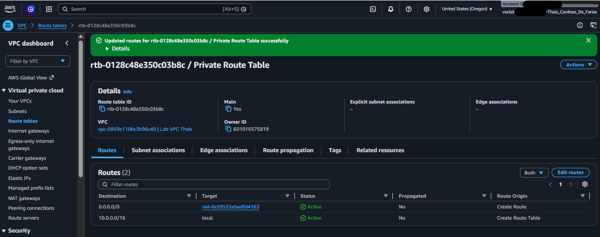
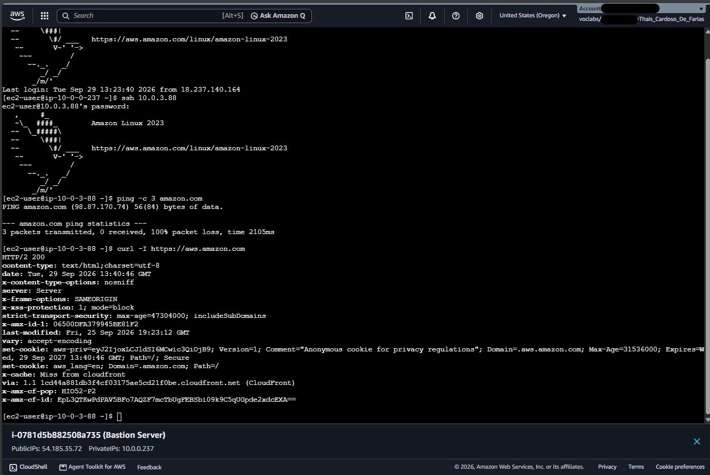

# AWS VPC Architecture: Public & Private Network Infrastructure

Projeto prático focado na construção de uma arquitetura de rede virtual segura e escalável na Amazon Web Services (AWS), utilizando **Virtual Private Cloud (VPC)**, sub-redes públicas e privadas, **Internet Gateway**, **NAT Gateway**, tabelas de roteamento e instâncias EC2 (**Bastion Host** e **Private Server**).

---

## 🛠️ Competências e Conceitos Demonstrados

* **Design de Redes AWS:** Criação de VPC customizada com endereçamento IPv4 e planejamento de CIDR block (`10.0.0.0/16`).
* **Segurança e Isolação:** Divisão de sub-redes públicas (com acesso direto à internet) e sub-redes privadas (isoladas do tráfego externo de entrada).
* **Roteamento de Tráfego:** Configuração de Route Tables dedicadas para gerenciar a saída e entrada de dados por sub-rede.
* **Gateways de Rede:** Integração de **Internet Gateway (IGW)** para recursos públicos e **NAT Gateway** para permitir atualizações/conectividade de saída em recursos privados sem expor IPs públicos.
* **Gerenciamento de Acesso Seguro (Bastion Host):** Acesso à instância isolada na sub-rede privada utilizando um servidor de salto (*Jumpbox / Bastion Host*) via SSH.

---

## 🚀 Passo a Passo da Implementação e Evidências

### 1. Criação da VPC
Criação da VPC isolada denominada `Lab VPC` utilizando o bloco CIDR `10.0.0.0/16` e habilitação do suporte a DNS hostnames.

---

### 2. Sub-redes Pública e Privada
Configuração de duas sub-redes na mesma Zona de Disponibilidade:
* **Public Subnet:** `10.0.0.0/24` com atribuição automática de IP público ativada.
* **Private Subnet:** `10.0.2.0/23` sem atribuição de IP público.

---

### 3. Internet Gateway (IGW)
Criação e associação do `Lab IGW` à `Lab VPC` para fornecer conectividade bidirecional com a internet para a sub-rede pública.

---

### 4. Tabela de Roteamento Pública
Criação da `Public Route Table`, associada à `Public Subnet`, incluindo uma rota `0.0.0.0/0` apontando para o `Lab IGW`.

---

### 5. Provisionamento do Bastion Host
Lançamento de uma instância EC2 Amazon Linux 2023 (`Bastion Server`) na sub-rede pública com Security Group liberando tráfego de entrada na porta 22 (SSH).

---

### 6. NAT Gateway e Rota Privada
Implantação do `Lab NAT gateway` na sub-rede pública acoplado a um Elastic IP. Atualização da `Private Route Table` com a rota `0.0.0.0/0` apontando para o NAT Gateway, permitindo tráfego de saída da sub-rede privada.

---

### 7. Teste de Conectividade da Instância Privada
Acesso à *Private Instance* (`10.0.3.88`) realizado com sucesso a partir do *Bastion Host* (`10.0.0.237`) via SSH. A conectividade de saída para a internet foi validada executando requisições na linha de comando (`curl -I https://aws.amazon.com`), confirmando que o *NAT Gateway* está roteando o tráfego de saída corretamente enquanto a instância permanece isolada de conexões externas diretas.

